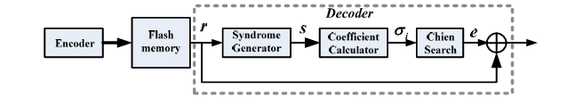

# BCH-15-7-2-
Verilog implementation of BCH (15, 7, t=2) encoder and decoder for NAND Flash error correction.
# BCH (15, 7, t=2) Encoder and Decoder

This repository contains the Verilog implementation of a **BCH (15, 7, t=2)** encoder and decoder. It is designed to detect and correct up to 2-bit errors in a 15-bit codeword. The project is intended for educational and practical purposes such as implementing error correction in NAND Flash memory systems.

---

## 📘 Overview

**BCH codes** (Bose–Chaudhuri–Hocquenghem) are powerful error-correcting codes constructed using Galois fields. This specific implementation uses a (15, 7, 2) BCH code, meaning:

- Codeword length: **15 bits**
- Message length: **7 bits**
- Corrects: **up to 2 errors**
- GF used: **GF(2⁴)** with primitive polynomial **x⁴ + x + 1**

---

## 🔧 Modules

### ▶️ Encoder
- encoder_15_7.v**: Generates 15-bit codeword from 7-bit message using LFSR (Linear Feedback Shift Register).
-tb_encoder_15_7.v:Testbench of encoder_15_7
### ▶️ Decoder
- **syndrome_block.v**: Calculates 4 syndromes (S1–S4) from the received codeword.
- **ibm_block.v**: Implements Berlekamp-Massey algorithm to find the error locator polynomial.
- **chien_block.v**: Performs Chien Search to find the roots of the locator polynomial.
- **errorcorr_block.v**: Generates the error vector and corrects the codeword.

### ▶️ Top-Level & Testbench
- **bch_top.v**: Integrates all modules into a complete encoder-decoder pipeline.
- **bch_top_tb.v**: Testbench to validate encoding, corruption, and correction.
- 
### ▶️ BCH FLOW CHART

